# Stock Trend Recommender System

**Keywords**: Recommender-System, Regression, Stock-Prediction

## Motivation

This project contains a stock-recommender system that uses quarterly reports, news information pieces and stock prices to recommend relevant stocks for further (manual) analysis based on user interest (e.g. resources or tech-companies). The system is designed for relevance, novelty and serendipity (with configurable parameters) to allow exploration of potential n-bagger stocks.

The goal of this project was to create a hybrid approach between machine learning and human interaction.
While the system will provide recommendations for stocks to the user, the user still has to make a final decision and analyze the stocks in detail.
This approach is not suited for short term (technical) trading. However, it allows more informed decisions for longer term investments.

Due to timely constraints for this project the overall goal is narrowed down to:

* Retrieve and clean stock data (i.e. stock prices, company statements) from various sources
* Use this stock data to predict the profitability of a stock on multiple time-scales
* Combine both features to compute a similarity between stocks and provide recommendations to the user based on input keywords and stock ranking

## Related Work & Libraries

There are several other projects and libraries that are working on similar goals. Most tasks are focused on stock price prediction.
Examples include:

* [Towards Data Science](https://towardsdatascience.com/stock-prediction-in-python-b66555171a2)
* [Predition using ML](https://medium.com/@randerson112358/predict-stock-prices-using-python-machine-learning-53aa024da20a)
* [LSTM Predictions](https://www.datacamp.com/community/tutorials/lstm-python-stock-market)

For the implementation of this project I have used various libraries, which are listed in the `readme.md`.

## Data Analysis

For the current state of the project, we are using a combination of income, balance-sheet and cash-flow statements for intermediary company information.
As well as actual stock prices and trading volume on a daily opening and closing date resolution. Both data is used to make predictions, while the statements and meta-information about the company (e.g. sector) is used for similarity matching.

This leaves us with the following data sources:

* FinancialModelingPrep - Used for Statement data, company information as well as a general overview of available stocks
* Kaggle Dataset - Provides cached stock data, which reduces our load on the APIs
* Alpha-Vantage - Historic and current stock price information

In order to retrieve the correct features, we perform a general analysis of the stock data.

**Stock Prediction**

The goal of the stock prediction system is to use current information:

* Last Statements from a given company
* Recent stock history

To predict the outcome of the stock data (i.e. would an invest in the stock be profitable over time horizon X). This leaves us with the following parameters for the data training:

1. Time Horizon of prediction (How long do we want to look in the future?)
2. Amount of Recent Data (Do we just give the current state of a windows of data from the past X days/month?)
3. Cliping of target values (in which interval is a stock profitable, neutral or unprofitable?)
3. Normalization of the Data (Do we use absolute values of differences?)
4. Smoothing of the Data (Do we take the stock closing price on a single day or of a week?)

The last two questions are probably easiest to answer. Since all stocks have different values (i.e. different start prices of the stock and current statement values) and these values do not have an impact on our prediction (if a \\$10 stock rises to \\$200 this is a much better investment than a \\$1000 stocks rise to \\$1500). We will therefore adopt a normalization that takes the current stock price as a starting point and computes percental difference from there. This will provide a normalized scale across all stocks.

For the smoothing we might use a time windows that is dependent on the length of the prediction (e.g. +/- 3 days for a quarter prediction and +/- 1 Week for a year prediction).

The normalized stock data was computed based on 22 day sliding window applied to the historic stock prices of each available symbol.
To analyze the target distributions, two parameters were modified (distance of days of the target value from the start price and size of the smoothing window).
The distributions can be seen below. The graphs are fixed to a range of 5 to -5 and the bar-charts use a total of 100 bins. As stock data is only recorded for work-days, the length of the window are in work days (with 22 days resulting in a month and 66 days in a quarter).

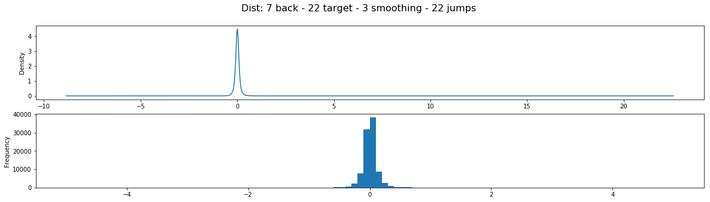

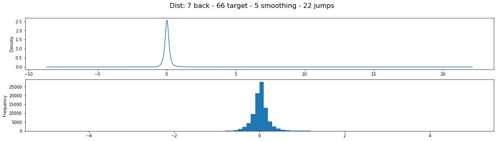
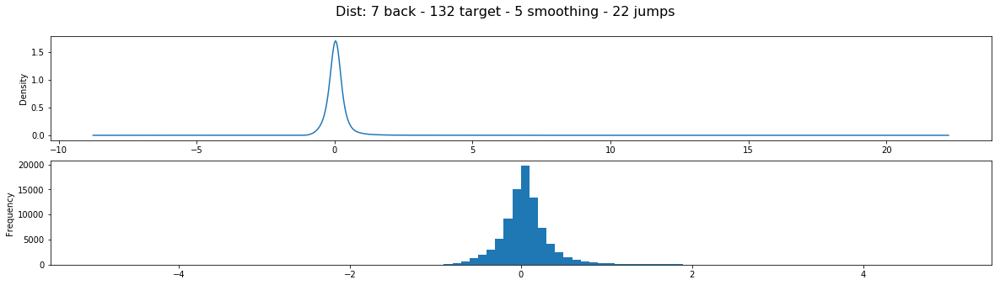
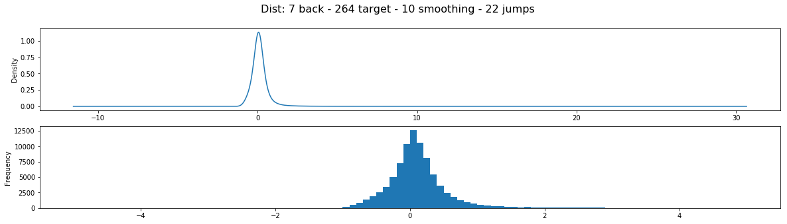

As one can see, the target values follow a normal distribution with growing variance over the look ahead length (as expected). Smoothing on the other hand appears to have negligible impact on the distributions.

Based on these data, clipping areas for the training data of models prediction for different time horizons can be chosen.
The normal distribution of the data also means an unequal balance of the training data for a classification approach (indicating that we might perform well using gaussian mixture models).

To better understand the prediction power of historic data on future values, the category data was divided into 6 categories (based on the percentage of change from the current day value). Then the correlation of the historic data w.r.t. the categories was calculated.

> The correlation for each day was calculated and averaged. In order to account for non-linear factors we use Spearman correlation.

The following data is an excerpt from the correlations calculated on different datasets (more can be found in the `./imgs/` folder)

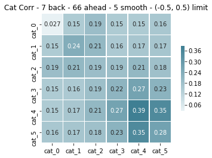
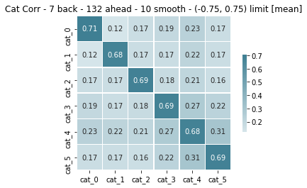
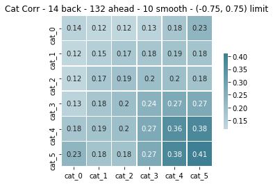
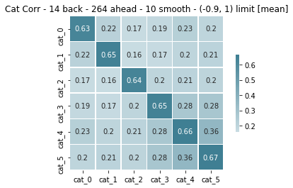
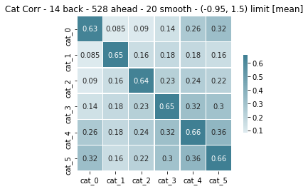
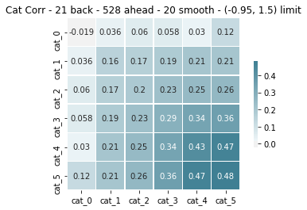

> Note that the lower limit is capped before -1 as no stock descents to 0 (except in a bankruptcy, in which case the stock is not traded any more, so there are no datapoints for that case)

The correlation matrixes show multiple things:

* Longer time horizons of historic data slightly improve correlations between similar classes
* Positive stocks seem to be more correlated in historic data
* There is no clear diagonal structure (esp. stocks moving in negative direction have a low self-correlation)

This could be an indicator that stock behavior (esp. over a longer time horizon) randomizes (or at least is not strongly dependent on previous performance). (A common piece of knowledge already advocated by many trading books).

In order to improve the prediction power of the data w.r.t. the target categories, statement information was added to get a better understanding of the underlying fundamentals of a company. One would expect that this increases the correlation, as it provides information commonly used by big wall street traders (e.g. Benjamin Graham, Waren Buffet or Peter Lynch).

**Recommender System**

For the recommender system, we will use data from company profiles to identify the similarity between stocks.
There are a total of 15525 company profiles in the dataset collected for this task. The actual industries and sectors are distributed as follows:

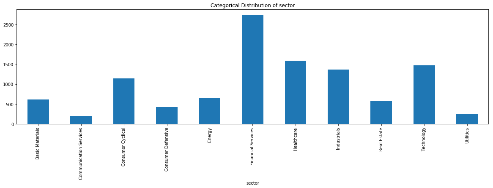
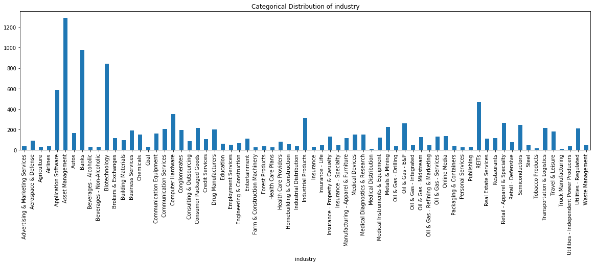
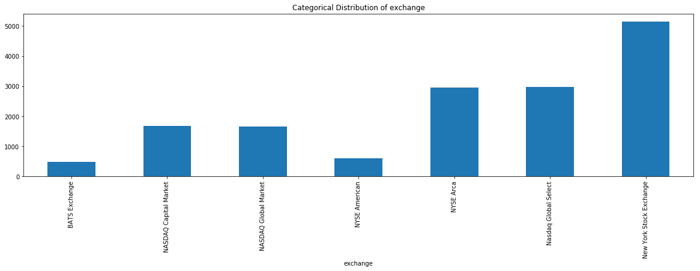

As the distributions show, there is a certain imbalance in the datasets. `Financial Services`, `Healthcare` and `Technology` (among a few others) are clearly over-represented in the data. Those trends re-appear in the industry section in finer granularity, with `Asset Management` by far the largest (followed by `banks` and `biotechnology`).
This might cause a certain bias in the training of the recommender systems.

Each company profile also has a description that can be used to detect similarities. To identify relevant clusters, I have extracted the Noun-Phrases from each description and transformed them into a vector set (i.e. Existence Vectorizer). I then performed t-SNE as dimensionality reduction to visualize the data in 2D. The points are colored according to their sector.

## ML Pipeline Design

**Stock Prediction**

* Trained as classifier
* Trained as regression

**Recommender**

Since we have no ground-truth data for the similarity between stocks (e.g. a dataset with user-investments), the measuring of the absolute quality of the results is difficult.

## Results

> The results are currently available through a Streamlit Report (in the `notebooks` folder). The web-app is currently not functional, but I am planning on developing it in the near future.

## Future Work

Due to time constraints the current state of the project is not the full scope, and there remains a lot left to do.
As mentioned in the motivation, news data could be used to provide a broader context of the company position.
This could be done on a variety of sources (e.g. RSS Feeds, twitter data, news corpora in general (Note: there appears to be a [corpus from HuffPost](https://www.kaggle.com/rmisra/news-category-dataset) with news from 2012 to 2018)).
This would require broader pre-processing pipeline (including NER and mapping news to relevant stock symbols, document embedding) to create a clean training dataset.
Such a dataset could be useful to extract further higher order features (e.g. sentiments) to identify psychological trends in the market.

Another way to improve the system would be the usage of more complex prediction methods (e.g. more advanced RNN approaches) or the use of online learning (e.g. through reinforcement learning) to adjust the trading strategy to the user needs.

From the engineering site, the web-app needs to be updated and the spark process could be streamlined.

## Conclusion

In this project, we have created a basic trading advisor for stock trading. It comprises a two step ML pipeline (prediction, recommendation) to advise potentially relevant stocks to the user.

As with most machine learning pipelines, a large chunk of the work for this project was distributed to pre-processing of the data. Resulting in a large library of functions that provide a solid entry point for further experiments with stock related information system.

The results show that the system can perform TODO.
